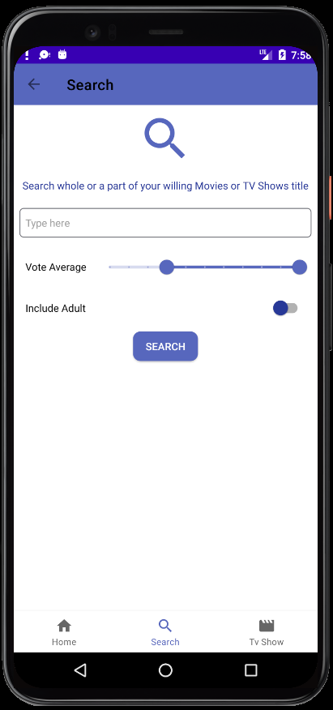

# ARMovie

## Introduction
This is a movei application based on the MVVM architectural pattern using [The TMDB Movie Database](https://www.themoviedb.org/).

## Technologies & Architecture 

#### Technologies
* Android, Kotlin
* [The Movie Database](https://www.themoviedb.org/)
* [Retrofit](https://github.com/square/retrofit) 
* [Glide And Gson](https://square.github.io/picasso/) - Loading images, caching
* [Kodein](https://kodein.org/Kodein-DI/?5.0/android) - dependency injection
* [Groupie](https://github.com/lisawray/groupie) - recyclerviews
* [Shimmer Animation](https://github.com/sharish/ShimmerRecyclerView)

#### Architecture
Model-View-ViewModel

* [ViewModel](https://developer.android.com/topic/libraries/architecture/viewmodel)
* [LiveData](https://developer.android.com/topic/libraries/architecture/livedata)
* [DataBinding](https://developer.android.com/topic/libraries/data-binding)
* [Navigation Component](https://developer.android.com/guide/navigation)
* [Kotlin Android Coroutines](https://developer.android.com/kotlin/coroutines)

## Features
**Home:** Lists of popular, no playing and upcoming movies

**TV Shows:** Most popular Tv shows at the time

**Show all:** Show movie list based on type (popular, in theaters, upcoming) //yet to be implemnted

**Movie details:** Title, genres, vote average, overview, date, runtime, videos, and cast

**TV Show details:** Title, genres, vote average, nmber of seasons, number of episodes, overview, seasons

**Person details:** name, biography, photos and known for

## Screenshots

### Bottom navigation

  
   
   

### Movie, TV Show and Person Details

  
   
   

